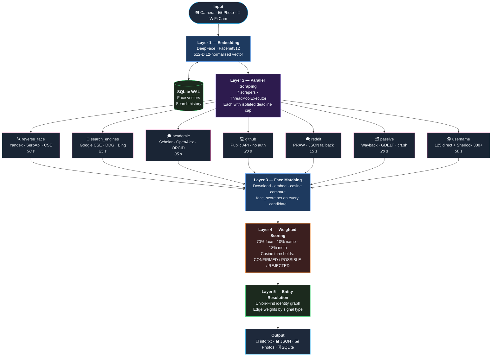
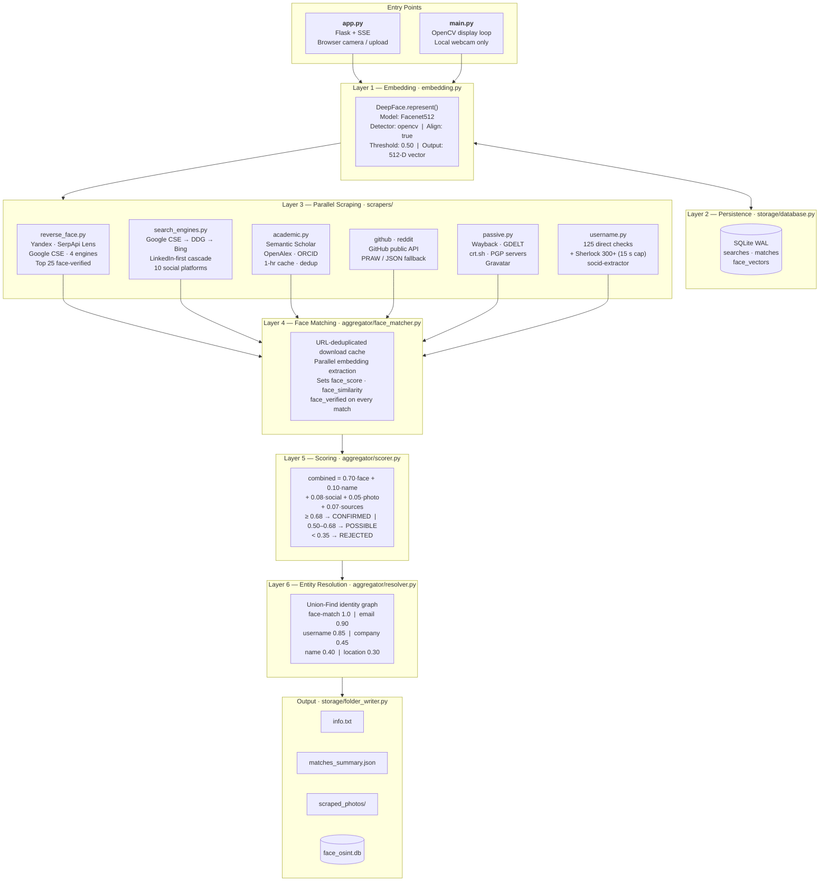
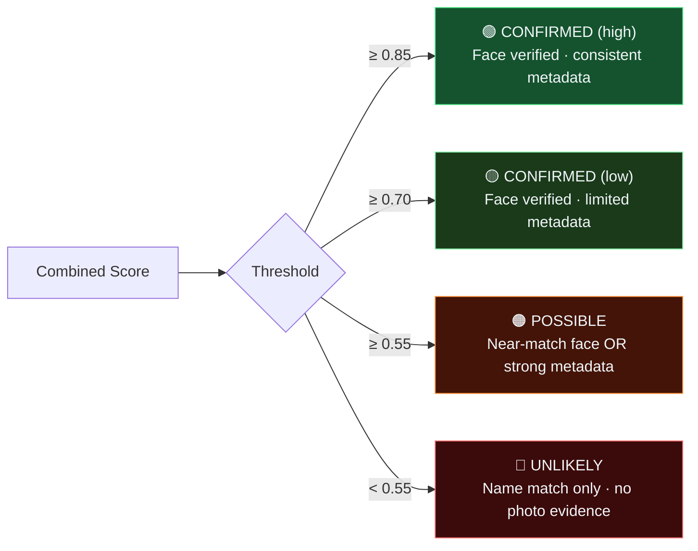

<div align="center">

# Face OSINT

**Capture a face. Get an identity.**

Point your camera at someone, upload a photo, or stream from a phone —  
Face OSINT searches 10+ open-source intelligence sources simultaneously,  
face-verifies every result, and delivers a ranked, de-duplicated identity profile in under two minutes.

[](https://python.org)
[](https://flask.palletsprojects.com)
[](https://github.com/serengil/deepface)
[](https://sqlite.org)
[](#responsible-use)

**No Docker. No Redis. No cloud accounts. No API keys required to start.**  
Runs entirely on your local machine with a single `pip install`.

> **This project is for research and educational purposes only.**

</div>

---

## Pipeline Overview



---

## Architecture



---

## Quick Start

```bash
# Python 3.10 or 3.11 required  (3.12 breaks TensorFlow 2.16)
pip install -r requirements.txt

cp .env.example .env          # all keys optional — works without any

python diagnose.py             # health check: packages, keys, network
python app.py                  # web UI — browser opens automatically
```

> First run downloads Facenet512 model weights (~600 MB) into `data/models/` once.

---

## Verdict System



> **Face similarity alone** gates the "POSSIBLE" threshold — text metadata alone can reach a maximum combined score of 0.28, which is below the 0.50 floor.

---

## Input Modes

| Mode | How to use |
|---|---|
| **Browser camera** | Click the Camera tab → allow browser access → click Capture |
| **File upload** | Drag and drop or select any JPEG / PNG / WebP |
| **WiFi / IP camera** | Install [IP Webcam](https://play.google.com/store/apps/details?id=com.pas.webcam) (Android) · tap Start server · enter `IP:8080` in the WiFi Cam tab |
| **Name hints** | Append context to the name field: `John Smith \| New York @ Acme Corp` |

**Name hint syntax:**

```
John Smith | New York               ← location context
John Smith @ Acme Corp             ← employer context
John Smith | New York @ Acme Corp  ← both
```

---

## Scraper Reference

| Scraper | Timeout | Sources | Notes |
|---|---|---|---|
| `reverse_face` | 90 s | Yandex · SerpApi Lens · Google CSE | 4 engines parallel · face-verifies top 25 hits |
| `search_engines` | 25 s | Google CSE → DDG → Bing | LinkedIn-first · 10 social platforms |
| `academic` | 35 s | Semantic Scholar · OpenAlex · ORCID | 1-hr cache · Scholar dedup by user ID |
| `github` | 20 s | GitHub public API | 5,000 req/hr with token · 60/hr without |
| `reddit` | 15 s | PRAW · public JSON fallback | No auth required |
| `passive` | 20 s | Wayback · GDELT · crt.sh · PGP · Gravatar | Certificate transparency + key servers |
| `username` | 50 s | 125 direct platform checks | + Sherlock 300+ (15 s internal cap) |

> LinkedIn enrichment loop: `reverse_face` confirmed hits are re-fed into `search_engines` for deeper profile discovery.

---

## API Keys

All keys are optional. The system runs on ~8 free sources with no configuration.

Copy `.env.example` → `.env` and fill in what you have.

| Key | Where to get | Free tier | Unlocks |
|---|---|---|---|
| `GOOGLE_CSE_KEY` + `GOOGLE_CSE_ID` | [programmablesearchengine.google.com](https://programmablesearchengine.google.com) | 100 req/day | Best LinkedIn + social search |
| `SERPAPI_KEY` | [serpapi.com](https://serpapi.com) | 100 req/month | Google Lens + Yandex face search |
| `IMGBB_API_KEY` | [imgbb.com/api](https://imgbb.com) | Free | Image hosting for SerpApi upload |
| `GITHUB_TOKEN` | GitHub → Settings → Developer tokens | Free | 5,000 req/hr (vs 60/hr unauthenticated) |
| `GITLAB_TOKEN` | GitLab → Profile → Access Tokens | Free | GitLab user search (required since 2024) |
| `BING_API_KEY` | Azure → Bing Search v7 | 1,000 req/month | Bing web + visual search |
| `BRAVE_API_KEY` | [api.search.brave.com](https://api.search.brave.com) | 2,000 req/month | Brave Search results |
| `HUNTER_API_KEY` | [hunter.io/api-keys](https://hunter.io/api-keys) | 25 req/month | Email intelligence |
| `REDDIT_CLIENT_ID` + `SECRET` | reddit.com/prefs/apps | Free | Authenticated Reddit API |
| `OPENALEX_MAILTO` | any email address | Free | OpenAlex polite pool (higher rate limits) |

```bash
python diagnose.py    # see which keys are active and test connectivity
```

---

## Output Structure

```
data/output/
└── John_Doe_20260404_1430_a1b2c3d4/
    ├── captured_photo.jpg        original camera frame
    ├── face_crop.jpg             160×160 aligned face crop (Facenet512 input)
    ├── info.txt                  human-readable plaintext report
    ├── matches_summary.json      full structured data — all scores + metadata
    └── scraped_photos/
        ├── github_johndoe_a1b2.jpg
        ├── reverse_face_yandex_c3d4.jpg
        └── ...
```

Search history and face vectors are persisted in `data/face_osint.db` (SQLite WAL).

---

## CLI Interface

```bash
python main.py    # OpenCV window — click the window first to capture keystrokes
```

| Key | Action |
|---|---|
| `SPACE` | Freeze frame → enter name → start full OSINT search |
| `F` | Flip / mirror the camera feed |
| `D` | Diagnostic — print cosine distances against all stored face vectors |
| `H` | Toggle HUD overlay |
| `Q` | Quit |

---

## Tech Stack

| Component | Library | Why |
|---|---|---|
| Face embedding | [DeepFace](https://github.com/serengil/deepface) + Facenet512 | 512-D L2-normalised vectors, ArcFace-level accuracy |
| Web UI | Flask + Server-Sent Events | Zero-install, live progress streaming |
| Camera | OpenCV (`cv2`) | Native Windows webcam + MJPEG WiFi streams |
| Persistence | SQLite (WAL mode) | Single file, zero config, thread-safe |
| HTML parsing | BeautifulSoup + lxml | Fast, lenient scraping of search results |
| Name matching | rapidfuzz | Fuzzy string scoring for entity resolution |
| Username OSINT | [Sherlock](https://github.com/sherlock-project/sherlock) + direct checks | 300+ platforms |

**Design constraints:** single process · no Celery / Redis / Docker / PostgreSQL · daemon threads + `ThreadPoolExecutor` · all shared state behind `threading.Lock`.

---

## Requirements

- Python **3.10** or **3.11** — TensorFlow 2.16 does not support 3.12
- ~600 MB disk for Facenet512 model weights (downloaded once on first run)
- Webcam, WiFi camera, or file upload

```bash
pip install -r requirements.txt
```

Optional extras for better coverage:

```bash
pip install sherlock-project    # username scraper (300+ platforms)
pip install socid-extractor     # social ID extraction
pip install praw                # authenticated Reddit API
```

---

## Troubleshooting

| Symptom | Fix |
|---|---|
| **"No face detected"** | Face must fill ≥ 20% of the frame · avoid backlighting · move closer |
| **`no_results` on a common name** | Add context: `John Smith \| London` or `John Smith @ Google` |
| **Search takes ~90 seconds** | Expected — `reverse_face` downloads and face-verifies up to 25 candidate photos |
| **TensorFlow import errors** | Use Python 3.10 or 3.11 — TF 2.16 does not support 3.12 |
| **LinkedIn always 0 results** | Set `GOOGLE_CSE_KEY` + `GOOGLE_CSE_ID` in `.env` |
| **WiFi camera won't connect** | Phone and PC must be on the same subnet · test `http://IP:8080/video` in a browser first |

```bash
python diagnose.py    # end-to-end health check with targeted fix instructions
```

---

## Data & Privacy

Everything stays on your machine — no telemetry, no cloud sync.

| Path | Contents |
|---|---|
| `data/face_osint.db` | Search history, match records, 512-D face vectors |
| `data/output/` | Per-search folders: photos, reports, JSON |
| `data/models/` | DeepFace model weights (~600 MB, downloaded once) |
| `logs/` | Rotating logs, 10 MB × 5 files |

To wipe all search data: delete `data/face_osint.db` and `data/output/`.  
The tool makes no outbound connections except to the scraping sources listed above.

---

## Responsible Use

This tool is built for **legitimate OSINT research** — verifying identities, locating missing persons, investigating fraud, academic research, and penetration testing with explicit authorisation.

Do not use it to stalk, harass, or build unauthorised profiles of private individuals.  
Comply with applicable laws in your jurisdiction. Respect platform terms of service.
